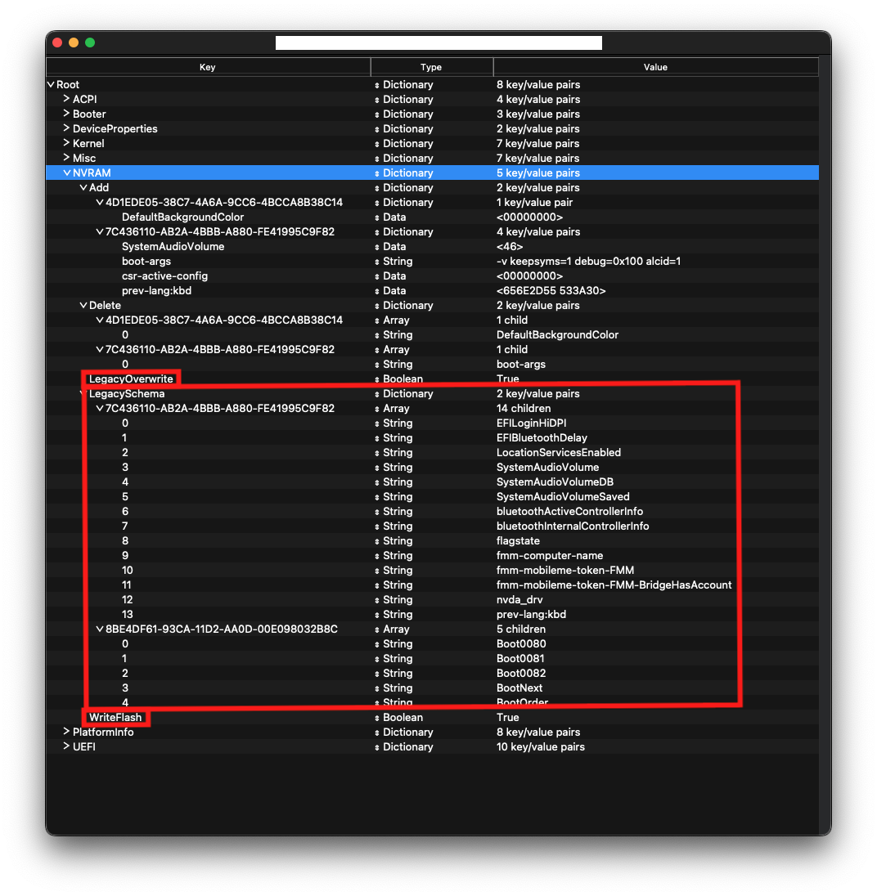

# Emulated NVRAM

So this section is for those who don't have native NVRAM, the most common hardware to have incompatible native NVRAM with macOS are X99 and some X299 series chipsets:

* X99
* X299

For B360, B365, H310, H370, Z390 users, make sure you have [SSDT-PMC](https://dortania.github.io/Getting-Started-With-ACPI/) both under EFI/OC/ACPI and config.plist -> ACPI -> Add. For more info on making and compiling SSDTs, please see [**Getting started with ACPI**](https://dortania.github.io/Getting-Started-With-ACPI/)

**Note**: 10th gen CPUs do not need this SSDT

## Cleaning out the Clover gunk

So some may not have noticed but Clover may have installed RC scripts into macOS for proper NVRAM emulation. This is an issue as it conflicts with OpenCore's method of emulation.

Files to delete:

* `/Volumes/EFI/EFI/CLOVER/drivers64UEFI/EmuVariableUefi-64.efi`
* `/Volumes/EFI/nvram.plist`
* `/etc/rc.clover.lib`
* `/etc/rc.boot.d/10.save_and_rotate_boot_log.local`
* `/etc/rc.boot.d/20.mount_ESP.local`
* `/etc/rc.boot.d/70.disable_sleep_proxy_client.local.disabled`
* `/etc/rc.shutdown.d/80.save_nvram_plist.local​`

If folders are empty then delete them as well:

* `/etc/rc.boot.d`
* `/etc/rc.shutdown.d​`

## Verifying if you have working NVRAM

To start, open the terminal and run the following one line at a time:

```sh
sudo -s
nvram -c
nvram myvar=test
exit
```

Now reboot and run this:

```sh
nvram -p | grep -i myvar
```

If nothing returns then your NVRAM is not working. If a line containing `myvar test` returns, your NVRAM is working.

Note: `nvram -c` requires SIP to be off, an alternative is to wipe NVRAM at the boot menu. Reminder you'll need to have the `AllowNvramReset.efi` driver from OpenCorePkg in your Drivers folder and `config.plist -> UEFI -> Drivers`.

## Enabling emulated NVRAM (with a nvram.plist)

To enable emulated NVRAM, you will need to configure several things in your EFI and config.plist

Within your EFI:

* `OpenRuntime.efi` driver (this is needed for proper sleep, shutdown and other services to work correctly)
* `OpenVariableRuntimeDxe.efi` driver (this is needed for enabling emulated NVRAM functionality - already included with OpenDuet (legacy BIOS only) systems)

And within your config.plist:



* **Booter -> Quirks**:
  * `DisableVariableWrite`: set to `False`
* **Misc -> Security**:
  * `ExposeSensitiveData`: set to `0x1`
* **NVRAM**:
  * `LegacyOverwrite` set to `True`
  * `LegacySchema`: NVRAM variables set (OpenCore compares these to the variables present in nvram.plist)
  * `WriteFlash`: set to `True`
* **UEFI -> Drivers**:
  * `OpenVariableRuntimeDxe.efi`: loaded before `OpenRuntime.efi` (`OpenRuntime.efi`'s entry needs to have a number higher than the one of `OpenVariableRuntimeDxe.efi`'s entry)
  * `OpenVariableRuntimeDxe.efi`: `LoadEarly` set to `True`
  * `OpenRuntime.efi`: `LoadEarly` set to `True`

Now grab the [LogoutHook folder](https://github.com/acidanthera/OpenCorePkg/releases)(Inside `/Utilities/LogoutHook/`) and place it somewhere safe (e.g. within your user directory, as shown below):

`/Users/$(whoami)/LogoutHook/`

Open up terminal and run the following (one at a time):

```sh
cd /Users/$(whoami)/LogoutHook/
./Launchd.command install
./Launchd.command install daemon
./Launchd.command install logout
```

Replace `/Users/$(whoami)/LogoutHook/` with your path (if you placed it in another path)

And voila! You have emulated NVRAM!

The Launchd.command script will now run on every shutdown/reboot of your machine and write any NVRAM changes done to the `EFI/NVRAM/nvram.plist`.
